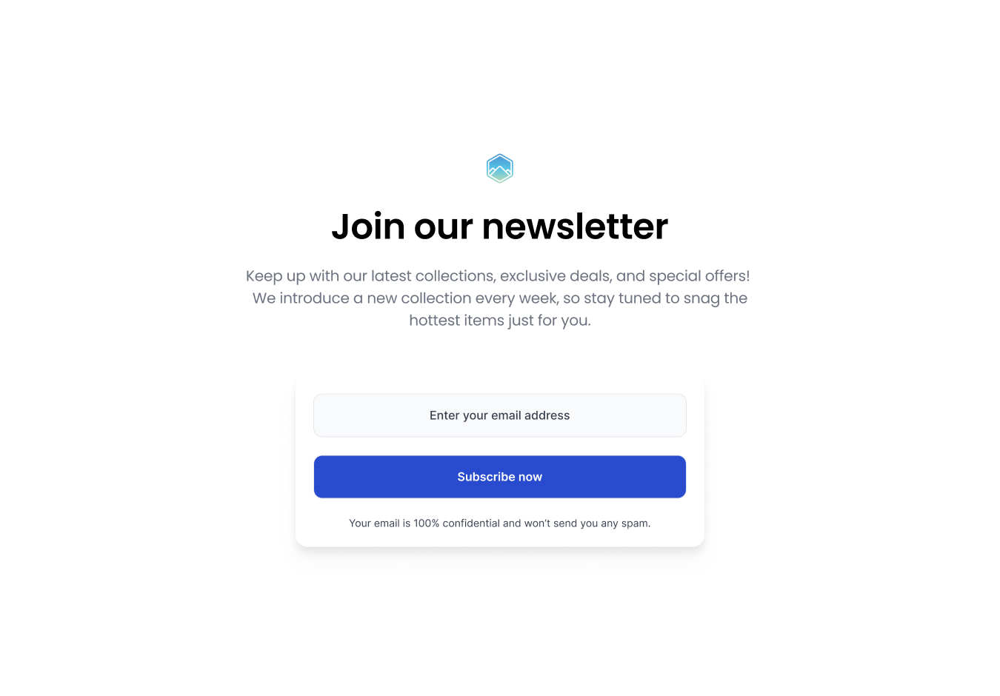

# Join Our Newsletter | devChallenges

   Solution for a challenge <a href="https://devchallenges.io/challenge/join-our-newsletter-challenge" target="_blank">Join Our Newsletter<a> from <a href="http://devchallenges.io" target="_blank">devChallenges.io</a>.

  <h3>
    <a href="#">
      Demo
    </a>
     | 
    <a href="https://devchallenges.io/challenge/join-our-newsletter-challenge">
      Challenge
    </a>
  </h3>

## Table of Contents

- [Overview](#overview)
  - [What I learned](#what-i-learned)
- [Built with](#built-with)
- [Acknowledgements](#acknowledgements)
- [Author](#author)

## Overview

This project creates a clean newsletter signup page that feels welcoming rather than aggressive. The goal was to create something that would really make people want to subscribe by following the design guide provided.

Working on this challenge led me to learn the basics of web conversation - how to ask someone for their email without being annoying? It turns out that good design, relaxed text, and details that are comfortable to look at can make everything look reliable.

This project started as a [DevChallenges](https://devchallenges.io/challenges-dashboard) challenge and ended up teaching me way more about user experience than I expected from a "simple" form.

### What I learned

Building this newsletter signup taught me that simple doesn't mean easy:

- **Fundamentals of HTML structure**: Creating the structure of the page was like building the skeleton of a house. Each element used for a purpose, always having room for improvement.

- **Format and hierarchy of text**: Following the design guides, making everything look neat and similar without losing the cleanliness and clarity of the design was exciting. Playing with font sizes, line heights, and text colors until everything seemed balanced was surprisingly satisfying.

- **Form Elements**: Working with `<input>` and `<button>` elements opened up a whole world of considerations I hadn't thought of, as well as presenting margins for functionality and improvement without moderation. Email entries need proper validation (we still have to work on that), buttons should provide feedback when pressed, and the entire form should feel responsive and alive to be comfortable.

- **CSS styling from scratch**: Writing CSS for this project felt like painting – you start with basic shapes and colors, then gradually add details until everything clicks together. Learning to style form elements, create hover effects, and make responsive layouts taught me how much control CSS gives you over the UX.

## Built with

- Semantic HTML5 markup
- Modern CSS3 styling
- CSS Flexbox for layout
- Responsive design principles [mobile first]
- Custom CSS properties for theming

## Acknowledgements

- [DevChallenges.io](https://devchallenges.io/) for creating challenges that teach practical skills you actually use in real projects
- [MDN Web Docs](https://developer.mozilla.org/) for form documentation that doesn't make you want to give up
- [CSS-Tricks](https://css-tricks.com/) for showing me that CSS can be creative and fun, not just functional

## Author

- Website [join_our_newsletter](#)
- GitHub [@nana-v1](https://github.com/nana-v1)
